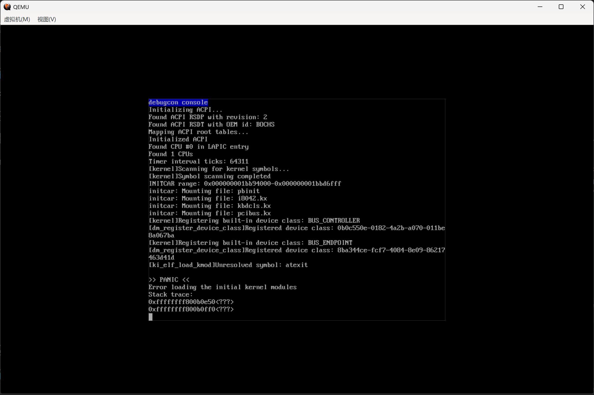
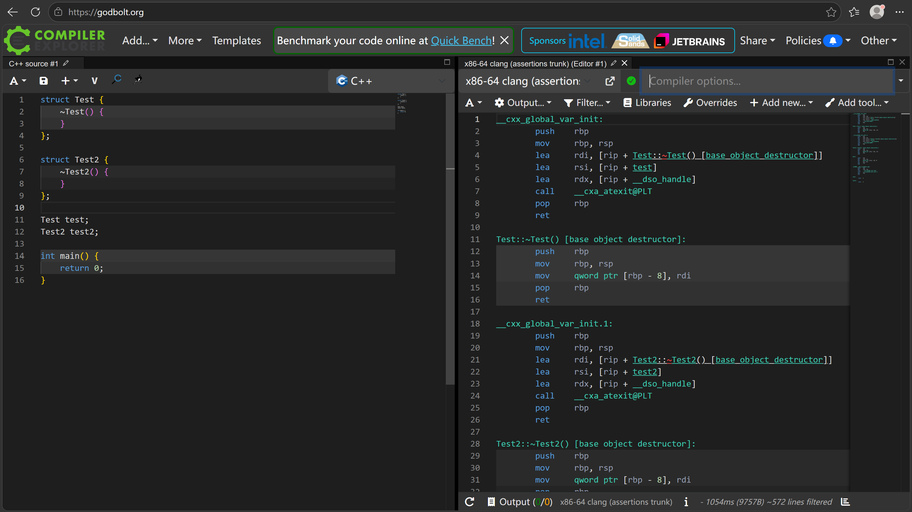
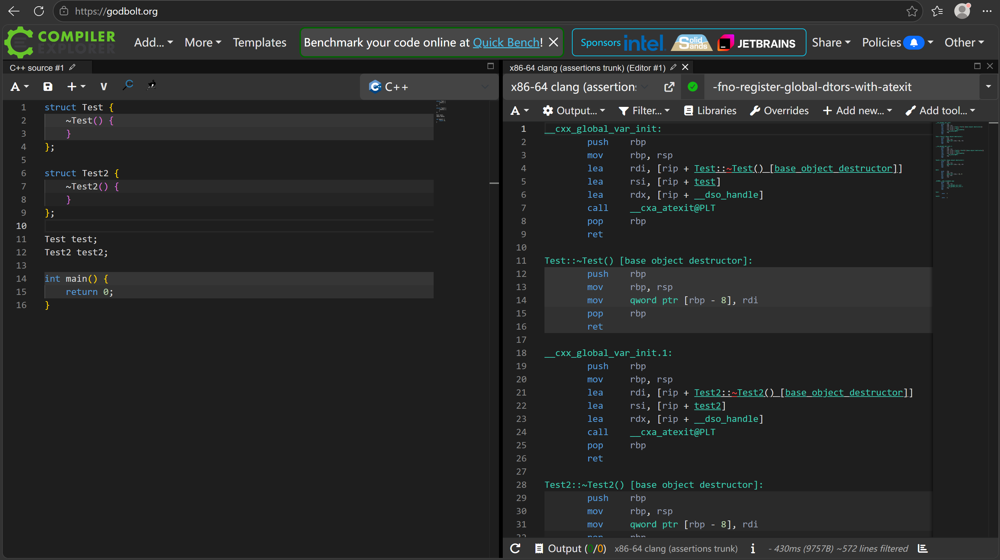
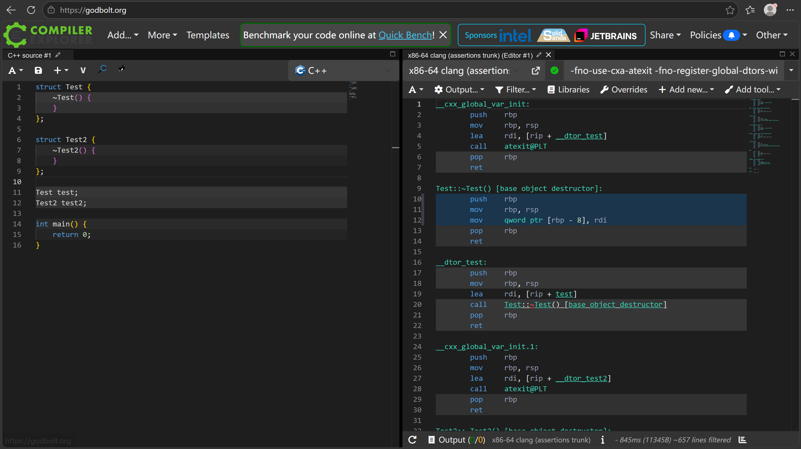
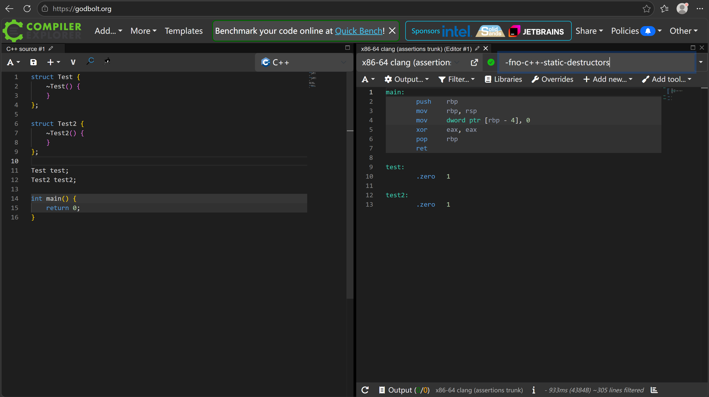

# 关于LLVM总是添加__cxa_atexit和atexit的问题

众所周知，GCC有一个`-fno-use-cxa-atexit`用于在嵌入式等环境中禁用以`__cxa_atexit`调用来注册析构函数的全局对象析构方法，转而使用`.fini_array`配合C++运行时支持（可以自己实现）的方法实现全局对象析构。此方法在嵌入式和裸机编程中十分常见，甚至是某些环境下的刚性要求。

然而在实践中，Clang++对此的支持似乎存在问题，如果使用上述选项禁用`-fno-use-cxa-atexit`编译器不会去使用`.fini_array`，反而会转头使用`atexit`代替。而另一个看似与之相关的选项`-fno-register-global-dtors-with-atexit`在这种情况下完全无济于事（详见[https://github.com/llvm/llvm-project/issues/210530](这个issue)），对于在获取通用freestanding工具链困难的原生Windows平台下进行兼容GCC工具链的裸机开发（例如OS内核）的开发者来说无疑是灭顶之灾。

Compiler Explorer的编译结果如下：

使用`-fno-c++-static-destructors`可以暂时解决该问题，代价是可能无法正常触发C++全局对象的析构函数，对于内核等不会进行退出或卸载的程序尚可，但对于内核模块等情景则是无法忽视的致命问题。

截至本文初稿完成当天（2026年7月25日），LLVM仍未修复该问题，因此如果要在原生Windows平台上开发兼容GCC的C++裸机程序，只能选择以下几种解决方案：

1. 使用`-fno-c++-static-destructors`禁用C++全局对象的析构函数
2. 自己用MSYS2装一个GCC代替Clang
3. 在WSL里直接使用原生GCC编译代码，然后其余操作用Windows的原生方式
4. 如果你足够强悍，可以自己修复这个bug然后给LLVM提PR，顺便赚波Contribution
